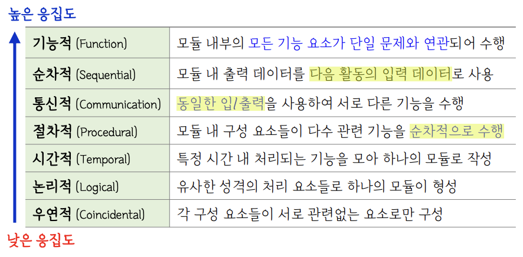
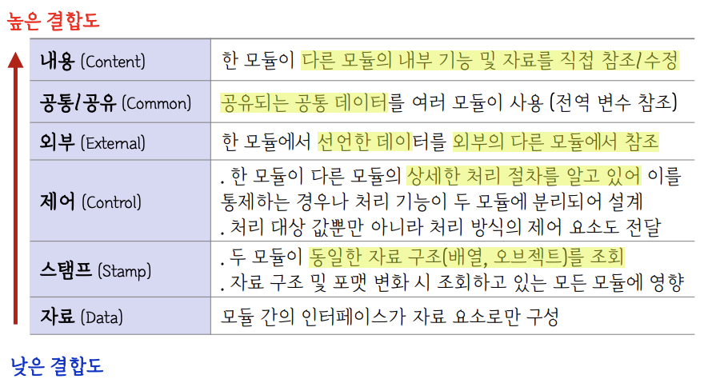

## 📕 1. 소프트웨어 구축

### 소프트웨어 생명주기 (SDLC, Software Development Life Cycle)
- 프로젝트 계획 - 요구사항 분석 - 설계 - 구현 - 테스트 - 유지 보수

### 계획
- 전문가 감정 기법 : **두 명 이상의 전문가**에게 비용 산정을 의뢰
- 델파이 기법 : **한 명의 조정자**와 **여러 전문가**의 의견을 종합

- COCOMO : **보헴**의 제안 / 원시코드 라인 수 기반
  - 조직형(Organic) 5만 이하 / 반분리형(Semi-detached) 30만 라인 이하 / 내장형(Embedded) 30만 라인 이상

- PUTNAM : **노력의 분포**를 이용한 비용 산정 / Rayleigh-Norden 곡선의 노력 분포도를 기초로 함
  - SLIM : Rayleigh-Norden 곡선 / Putnam 모형 기초로 개발된 자동화 추정 도구

- Function Point(FP) : SW 기능 증대 요인에 **가중치 부여 후 합산**하여 기능점수 산출
  - SW 기능 증대 요인 : 자료 입력 / 정보 출력 / 명령어 / 데이터 파일 / 인터페이스
  - ESTIMACS : FP 모형을 기반으로 하여 개발된 자동화 추정 도구

### 요구사항 분석
- 요구사항 개발 프로세스 : 도출/추출 - 분석 - 명세 - 확인/검증 == 도분명확(순서 중요)

- 요구사항 분석 CASE
  - SADT : SoftTech 사에서 개발
  - SREM : 실시간 처리 SW 시스템에서 요구사항 명확한 기술 목적
  - PSL/PSA : 문제 기술언어 및 요구사항 분석 보고서 출력
  - TAGS : 시스템 공학 방법 응용에 대한 자동 접근 방법

- HIPO : 하향식 설계 방식 / 가시적, 총체적, 세부적 다이어그램으로 구성

- DFD (데이터/자료 흐름도) : `프로세스(원)` / `자료 흐름(화살표)` / `자료 저장소(평행선)` / `단말(사각형)`
  - 구조적 분석 기법에 사용, 시간 흐름 명확한 표현 불가, **버블 차트**

- DD (자료 사전) : `=` 정의 / `[ ]` 택일, 선택 / `( )` 생략 / `+` 구성 / `**` 설명,주석 / `{ }` 반복

- 객체지향 분석 모델
  - Booch : 미시적, 거시적 개발 프로세스를 모두 사용
  - Jacobson : **유스케이스**를 사용
  - Coad-Yourdon : **E-R 다이어그램** 사용
  - Rumbaugh : 가장 일반적으로 사용, **객체/동적/기능** 모델로 구분
    - 객체 모델링 : 객체 다이어그램
    - 동적 모델링 : 상태 다이어그램
    - 기능 모델링 : 자료 흐름도(DFD)

### 설계
- **추상화** : **불필요한 부분은 생략**하고 필요한 부분만 강조해 모델화
  - 과정 추상화 : **자세한 수행 과정 정의 X** , 전반적인 흐름만 파악가능하게 설계
  - 데이터(자료) 추상화 : **데이터의 세부적 속성/용도 정의 X**, 데이터 구조를 표현
  - 제어 추상화 : **이벤트 발생의 정확한 절차/방법 정의 X**, 대표 가능한 표현으로 대체

- UML(Unified Modeling Language) : 고객/개발자 간 원활한 의사소통을 위해 **표준화한 대표적 객체지향 모델링 언어**
  - 구성 요소 : **사물 / 관계 / 다이어그램**
  - **사물** : 구조 / 행동 / 그룹 / 주해 == **구행그주**
  - **관계** : 연관 관계 / 집합 관계 / 포함 관계 / 일반화 관계 / 의존 관계 / 실체화 관계
  - **다이어그램**
    - **구조, 정적 다이어그램** : 클래스 / 객체 / 컴포넌트 / 배치 / 복합체 구조 / 패키지 == **클객컴배복패**
    - **행위, 동적 다이어그램** : 유스케이스 / 시퀀스 / 커뮤니케이션 / 상태 / 활동 / 타이밍 / 상호작용 개요 == **유시커상활타**

- UI 설계 4가지 원칙 : 직관성 / **유연성** / 학습성 / **유효성** == **직유학유**

### 구현
- API(Application Programming Interface) : 소프트웨어 간 인터페이스

- **응집도** : **우논시 절통순기**
  - 개별 모듈이 독립적인 기능으로 정의되어 있는 정도 : 응집도가 높으면 품질이 높음

- **결합도** : **자스제 외공내**
  - 개별 모듈 간 상호 의존하는 정도 : 결합도가 낮으면 품질이 높음

- **객체 지향 특징** : 객체와 속성, 클래스와 멤버, 전체와 부분으로 나눠 분석
  - 객체 : 고유 식별자 / 상태(State), 행위,연산(Method) 보유
  - 클래스 : 공통 속성과 연산을 갖는 **객체들의 집합** / 인스턴스 : 클래스에 속한 각각의 객체
  - 추상화 : 객체의 공통적인 속성과 기능을 추출하여 정의 / **추상 클래스, 인터페이스**
  - 캡슐화 : 데이터와 데이터 처리 함수를 하나로 묶음 / 정보 은닉 : 외부 접근 제한
  - 상속 : 상위 클래스의 속성과 연산을 하위 클래스가 물려받는 것 / 다중 상속 : 단일 클래스가 두 개 이상의 상위 클래스로부터 상속
  - 다형성 : 하나의 메시지에 각 객체 별 고유 특성에 따라 여러 형태의 응답 / **오버라이딩, 오버로딩**

- **객체지향 설계 원칙 (SOLID)**
  - 단일 책임 원칙(SRP, Single Responsability Principle) : 모든 클래스/객체는 하나의 책임만
  - 개방 폐쇄의 원칙(OCP, Open Close Principle) : 확장에는 Open, 수정에는 Close
  - 리스코프 교체 원칙(LSP, Liskov Substitution Principle) : 상위 클래스의 행동 규약을 하위 클래스가 위반 X
  - 인터페이스 분리 원칙(ISP, Interface Segregation Principle) : 클라이언트가 비사용 메서드에 의존 X
  - 의존성 역전 원칙(DIP, Dependency Inversion Principle) : 의존 관계 수립 시 변화하기 어려운 것에 의존

- **디자인 패턴** : **서브시스템에 속하는 컴포넌트**들과 그 관계를 설계하기 위한 참조 모델 / 아키텍처 패턴 : **전체 시스템의 구조**를 설계
  - 생성 패턴 : **생빌 프로 팹앱싱**
    - Builder : 객체 생성 단계를 캡슐화/분리하여 **객체를 조립하여 생성**
    - Prototype : 원본/원형 객체를 복제하는 방식으로 객체를 생성
    - **Factory Method** : **상위클래스에서 객체 생성 인터페이스 정의**, 인스턴스를 만드는 클래스는 서브 클래스에서 결정
    - **Abstract Factory** : **구체적인 클래스에 의존하지 않고**, 서로 연관되거나 의존적인 객체들이 조합된 인터페이스 제공
    - Singleton : 클래스에서 **하나의 객체만 생성 가능**, 여러 프로세스가 동시에 참조는 불가
  - 구조 패턴 : **구브데 프로 컴어 퍼플**
    - Bridge : 구현부에서 추상층을 분리 후 각자 독립적으로 **변형/확장 가능**
    - Decorator : 객체 기능을 동적으로 **추가/확장**
    - **Proxy** : 접근이 힘든 객체를 연결하는 **인터페이스 역할 (대리 객체 수행)**
    - Composite : **트리 구조**로 부분/전체 계층 표현
    - Adapter : 비호환 **인터페이스 호환성 부여**하도록 변환
    - Facade : 상위에 인터페이스 구성하여 서브클래스의 기능을 단순한 인터페이스 구현
    - Flyweight: 인스턴스를 공유하여 메모리 절약 **(클래스 경량화)**
  - 행위 패턴 : **행 미인이 스트 비커 템옵 매체**
    - Mediator : **객체들간 복잡한 상호작용을 캡슐화**하여 객체로 정의 후 중재
    - Observer : 한 객체 상태 변화 시 상속되어 있는 객체들에 변화 전달
    - **Template Method** : 여러 클래스에서 **공통 사용 메서드를 상위 클래스에서 정의**, 하위 클래스마다 다르게 구현해야하는 세부 사항을 개별 구현

### 테스트
- 테스트 기반 테스트
  - 명세 기반 : 요구사항에 대한 명세를 빠짐없이 테스트 케이스로 구현 : **동등 분할 / 경계값 분석 (쁠랙박스)**
  - 구조 기반 : SW 내부 논리 흐름에 따라 테스트 케이스 작성/확인 : **화이트박스**
  - 경험 기반 : 테스터의 경험을 기반으로 수행

- **화이트박스 테스트** : **내부의 논리적인 모든 경로를 테스트**, 소스 코드의 모든 문장을 한 번 이상 수행, 테스트 데이터 선택하기 위해 **검증 기준 커버리지** 정함
  - 종류 : 기초 경로 검사 / 제어 구조 검사
  - 구문(문장) 커버리지 : **모든 명령문**을 적어도 한번 수행
  - 결정(분기) 커버리지 : **전체 결정의 분기**가 적어도 한번 수행
  - 조건 커버리지 : **각 개별 조건식**이 적어도 한번 참/거짓 결과 수행
  - 조건/결정 커버리지 : **전체 조건식 + 개별 조건식** **참 한번 이상, 거짓 한번 이상** 수행
  - 변경 조건/결정 커버리지 : 각 개별조건식이 독립적으로 전체 조건식의 결과에 영향
  - 다중 조건 커버리지 : 결정 포인트 내 모든 개별조건식의 **모든 가능한 논리적 조합을 고려**하여 **100% 커버리지 보장**

- **블랙박스 테스트** : 소프트웨어 인터페이스에서 실시되는 테스트 / **기능 테스트**라고 함
  - **동치 분할 검사** : 타당한 입력 자료, 타당하지 않은 입력 자료의 개수를 균등하게 진행 (각 영역을 대표할 수 있는 값을 선정)
  - 경계값 분석 : **입력 조건의 경계값**을 테스트 케이스로 선정
  - 원인-효과 그래프 검사 : **입력 데이터 간의 관계와 출력에 영향을 미치는 상황**을 분석
  - 오류 예측 검사 : **과거의 경험이나 확인자의 감각**으로 테스트 진행
  - 비교 검사 : **여러 버전의 프로그램에 동일한 결과가 출력**되는지 확인

- 워크 스루 : **요구사항 명세서 미리 배포** 후 짧은 검토 회의 진행
- 인스펙션 : 작성자 제외한 다른 전문가들이 결함 검토

- 생명주기에 따른 테스트 순서 : **단통시인**
  - 구현 -> 단위 테스트 : **최소 단위(모듈/컴포넌트)** 기반 테스트
  - 설계 -> 통합 테스트 : **모듈을 통합하는 과정**에서 발생하는 오류 확인 (상향식/하향식)
    - **스텁(Stub)** : 모듈의 기능을 단순히 수행하는 도구
  - 요구사항 분석 -> 시스템 테스트 : 개발된 SW의 컴퓨터 시스템 내 작용여부 점검
  - 계획 -> 인수 테스트 : 사용자의 요구사항 충족 여부 확인 - 알파 테스트 / 베타 테스트 진행

- 테스트 시나리오 : 테스트 케이스 적용/동작 순서에 따라 여러 테스트 케이스를 묶은 집합
- **테스트 오라클** : 테스트 결과의 참/거짓 판단 위해 사전에 정의된 참 값을 대입
  - 참 오라클 : 모든 테스트 케이스의 입력값에 기대 결과 제공
  - 샘플링 오라클 : 특정 테스트 케이스 입력값에 기대 결과 제공
  - 일관성 오라클 : 테스트 케이스의 수행 전/후의 결과값 동일 여부 확인

- 테스트 하네스
  - 테스트 드라이버 : 시험 대상의 하위 모듈 호출
  - 테스트 스텁 : 제어 모듈이 호출하는 하위 모듈의 역할 단순 수행
  - 테스트 슈트 : 시스템에 사용되는 테스트 케이스의 집합
  - 테스트 케이스 : 사용자의 요구사항 준수 여부 확인 위해 설계된 테스트 항목 명세서
  - 테스트 스크립트 : 자동화된 테스트 실행 절차에 대한 명세서

### 유지 보수
- 소스 코드 품질 분석 도구
  - 정적 분석 도구 : 프로그램 실행 없이 분석 - PMD, Checkstyle, SonarQube, Cppcheck, Ccm, Cobertur
  - 동적 분석 도구 : 프로그램 실행 하여 분석 - Avalanche, Valgrind, Valance

- 소프트웨어 형상 관리 (SCM, Software Configuration Management) : 개발 과정에서 SW 변경사항을 관리

- 소프트웨어 버전 관리 도구
  - 공유 폴더 : RCS, SCCS, PVCS, QVCS
  - 클라이언트/서버 : **CVS**, **SVN**, CVSNT, CMVC
  - 분산 저장소 : **Git**, GNU arch, DCVS, Bitkeeper, Bazaar

---

## 📕 2. 데이터베이스

- **데이터베이스(DBMS)** : 특정 조직 내 필요한 데이터들의 모임, 공용으로 소유/유지/이용하는 공용 데이터

### 스키마(Schema)
- 외부 스키마(서브 스키마) : **사용자 관점**의 스키마
- 개념 스키마 : **사용자 + DB 관리자 관점**의 스키마, 개체/관계/제약조건/접근권한/무결성 규칙 명세
- 내부 스키마 : **DB 설계자/개발자 관점**의 스키마, **물리적 저장장치에 구현**

### 데이터 언어
- DDL(Data Definition Language) : 구조/제약조건 정의
- DML(Data Manipulation ~) : 처리/조작에 사용
- DCL(Data Control ~) : 보안/권한/무결성/권한 검사/병행 제어

### 데이터베이스 설계 순서
- 요구조건 분석 - **개념적 모델** - **논리적 모델** - **물리적 모델** - 구현
  - 개념적 모델 : 트랜잭션 모델링, E-R 모델
  - 논리적 모델 : 트랜잭션 인터페이스 설계, 정규화
  - 물리적 모델 : 트랜잭션 작성, 반정규화

### 접근 통제 기술 (Access Control)
- 임의 접근 통제 (DAC, Discretionary AC) : **사용자의 신원/신분에 따라** 접근 권한 부여, 데이터 소유자가 접근 통제 권한 지정 (GRANT, REVOKE)
- 강제 접근 통제 (MAC, Mandatory AC) : **주체와 객체의 등급을 비교 후 시스템이 접근 권한 부여**, 자신보다 보안 높으면 읽기/수정/등록 불가 같으면 모두 가능 낮으면 읽기 가능
- 역할 기반 접근 통제 (RBAC, Role-based AC) : **사용자의 역할에 따라** 접근 권한 부여(중앙관리자가 지정), 다중 프로그래밍에 최적화

### 함수적 종속
- 완전 함수적 종속 : 종속자가 기본키에만 종속
- 부분 함수적 종속 : 기본키가 여러 종속으로 구성되어 있을 때 기본키를 구성하는 속성 중 일부만 종속
- 이행적 함수 종속 : X->Y, Y->Z 이면 X->Z

### 정규화
- 제 1정규형 : 모든 속성의 값이 원자값을 가져야 한다. (한 칸에 여러값 포함 X)
- 제 2정규형 : 제 1정규형 + 기본키의 일부에만 종속되는 속성이 없어야 한다. (부분 함수적 종속 제거)
- 제 3정규형 : 제 2정규형 + 이행적 함수 종속 제거
- BCNF : 모든 결정자가 후보키여야 한다. (X->Y 일때 X가 무조건 후보키)

---